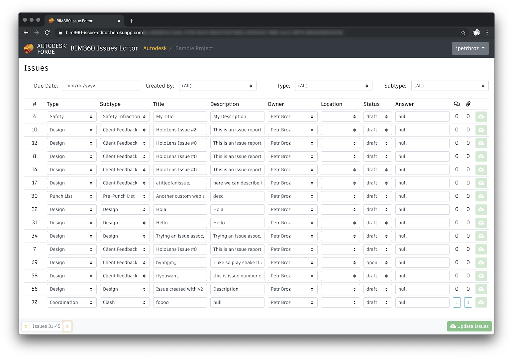

# bim360-issue-editor


[](https://forge.autodesk.com/en/docs/data/v2/reference)
[](https://forge.autodesk.com/en/docs/bim360/v1/reference)


Prototype application for bulk-editing [BIM 360](https://www.autodesk.com/bim-360/) issues
using [Autodesk Forge](https://forge.autodesk.com) APIs.



## Demo

https://bim360-issue-editor.herokuapp.com

In order to be able to access your BIM 360 project from this demo,
you will need to add the following Forge credentials as a [custom integration](https://forge.autodesk.com/en/docs/bim360/v1/tutorials/getting-started/manage-access-to-docs):

- Forge Client ID: `gnChEZ6tph1H9IAelM2mYufYZVU1qqKt`
- Forge App Name: `Internal BIM360 Testing App`

## Development

### Prerequisites

- [Node.js](https://nodejs.org) v10.15 or newer, and [yarn](https://yarnpkg.com)
- Forge application credentials ([creating an app](https://forge.autodesk.com/en/docs/oauth/v2/tutorials/create-app/))
- BIM 360 project with the Forge application added as a [custom integration](https://forge.autodesk.com/en/docs/bim360/v1/tutorials/getting-started/manage-access-to-docs)

### Setup

- clone this repository
- install dependencies: `yarn install`
- (for now) manually build the _forge-server-utils_ dependency: `cd node_modules/forge-server-utils && yarn run build:node`
- provide the following env. variables
  - `FORGE_CLIENT_ID` - client ID of your Forge application
  - `FORGE_CLIENT_SECRET` - client secret of your Forge application
  - `FORGE_APP_NAME` - name of your Forge application (used when asking user to setup the BIM 360 integration)
  - `HOST_URL` - URL where the demo application is running (for example, _http://localhost:3000_)
  - `SERVER_SESSION_SECRET` - secret phrase used to encrypt session cookies
  - `ENABLE_CLI_CONFIG` - (optional) set to `true` to enable the generation of configuration JSON
  for the CLI tools located under _bin/_

### Running

#### On macOS

```bash
export FORGE_CLIENT_ID=<client id>
export FORGE_CLIENT_SECRET=<client secret>
export FORGE_APP_NAME=<app name>
export HOST_URL=<host url>
export SERVER_SESSION_SECRET=<secret phrase>
yarn start
```

#### On Windows

```
set FORGE_CLIENT_ID=<client id>
set FORGE_CLIENT_SECRET=<client secret>
set FORGE_APP_NAME=<app name>
set HOST_URL=<host url>
set SERVER_SESSION_SECRET=<secret phrase>
yarn start
```

#### Using VSCode

When using [Visual Studio Code](https://code.visualstudio.com), add this configuration to your _.vscode/launch.json_:

```json
{
    "type": "node",
    "request": "launch",
    "name": "Launch Server",
    "program": "${workspaceFolder}/server.js",
    "env": {
        "FORGE_CLIENT_ID": "<client id>",
        "FORGE_CLIENT_SECRET": "<client secret>",
        "FORGE_APP_NAME": "<app name>",
        "HOST_URL": "<host url>",
        "SERVER_SESSION_SECRET": "<secret phrase>"
    }
}
```

## License

This sample is licensed under the terms of the [MIT License](https://tldrlegal.com/license/mit-license).
Refer to [LICENSE](LICENSE) for more details.

## Author

Petr Broz ([@ipetrbroz](https://twitter.com/ipetrbroz)), Forge Partner Development Group
